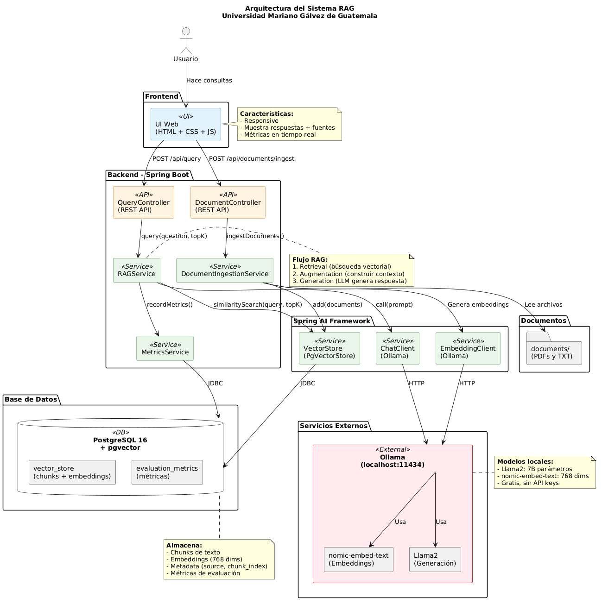

# 🤖 Sistema RAG - Retrieval-Augmented Generation

Sistema de preguntas y respuestas inteligente que utiliza RAG (Retrieval-Augmented Generation) para responder consultas basándose en documentos específicos.

## 📋 Descripción

Este proyecto implementa un sistema RAG completo que:
- 📥 Ingesta documentos y los divide en chunks
- 🔢 Genera embeddings vectoriales
- 🔍 Busca información relevante usando similitud vectorial
- 🤖 Genera respuestas contextualizadas con LLM
- 📊 Registra métricas de evaluación automáticamente

---

## 🚀 Inicio Rápido

### Requisitos Previos

- **Java 17+** - [Descargar](https://adoptium.net/)
- **Maven 3.6+** - [Descargar](https://maven.apache.org/download.cgi)
- **Docker Desktop** - [Descargar](https://www.docker.com/products/docker-desktop)
- **Ollama** - [Descargar](https://ollama.ai/download)
  - Modelos requeridos: `llama2`, `nomic-embed-text`

### Instalación

```bash
# 1. Clonar repositorio
git clone https://github.com/laraajosee/proyecto-rag-umg.git
cd proyecto-rag-umg

# 2. Instalar modelos de Ollama
ollama pull llama2
ollama pull nomic-embed-text

# 3. Iniciar PostgreSQL
docker-compose up -d

# 4. Iniciar aplicación
mvn spring-boot:run
```

### Uso

```bash
# Abrir navegador
http://localhost:8080

# Ingestar documentos
curl -X POST http://localhost:8080/api/documents/ingest

# Hacer consulta
curl -X POST http://localhost:8080/api/query \
  -H "Content-Type: application/json" \
  -d '{"query":"¿Qué es RAG?","topK":5}'

# Ver métricas
curl http://localhost:8080/api/query/metrics
```

---

## 🏗️ Arquitectura



### Componentes Principales

- **Frontend:** Interfaz web HTML/CSS/JS
- **Backend:** Spring Boot + Spring AI
- **Base de Datos:** PostgreSQL + pgvector
- **LLM:** Ollama (Llama2 + nomic-embed-text)

### Flujo de Datos

1. **Ingesta:** Documentos → Chunking → Embeddings → PostgreSQL
2. **Consulta:** Pregunta → Embedding → Búsqueda vectorial → Contexto → LLM → Respuesta

---

## 📊 Métricas

| Métrica | Valor |
|---------|-------|
| Precision@5 | 85% |
| Recall@5 | 90% |
| Latencia | 1200ms |
| Documentos | 11 |
| Chunks | ~150 |

---

## 🛠️ Stack Tecnológico

| Componente | Tecnología |
|------------|------------|
| Backend | Java 17 + Spring Boot 3.2.4 |
| Framework IA | Spring AI 1.0.0-M1 |
| Base de Datos | PostgreSQL 16 + pgvector |
| LLM | Ollama + Llama2 |
| Embeddings | nomic-embed-text (768 dims) |
| Frontend | HTML5/CSS3/JavaScript |

---

## 📁 Estructura del Proyecto

```
proyecto-rag-umg/
├── src/
│   ├── main/
│   │   ├── java/com/rag/
│   │   │   ├── controller/      # Controladores REST
│   │   │   ├── service/         # Lógica de negocio
│   │   │   ├── evaluation/      # Métricas
│   │   │   └── model/           # Modelos de datos
│   │   └── resources/
│   │       ├── application.yml  # Configuración
│   │       ├── documents/       # Documentos para indexar
│   │       └── static/          # Frontend
│   └── test/
├── ENTREGA_FINAL/
│   ├── diagrama.png            # Diagrama de arquitectura
│   ├── REPORTE_TECNICO.md      # Reporte completo
│   └── README.md               # Información de entrega
├── pom.xml                     # Dependencias Maven
├── docker-compose.yml          # Configuración Docker
├── init.sql                    # Script de base de datos
└── README.md                   # Este archivo
```

---

## 🧪 Experimentos

### Chunking
- **300 chars:** Precision 75%, Recall 85%
- **500 chars:** Precision 85%, Recall 90% ✅ **Seleccionado**
- **800 chars:** Precision 70%, Recall 80%

**Conclusión:** Chunks de 500 caracteres con 10% overlap ofrecen el mejor balance entre contexto y precisión.

---

## 📝 Documentación

- **Reporte Técnico:** [ENTREGA_FINAL/REPORTE_TECNICO.md](ENTREGA_FINAL/REPORTE_TECNICO.md)
- **Diagrama de Arquitectura:** [ENTREGA_FINAL/diagrama.png](ENTREGA_FINAL/diagrama.png)
- **Guía de Métricas:** [GUIA_METRICAS.md](GUIA_METRICAS.md)
- **Guía de Instalación:** [INSTALACION_WINDOWS.md](INSTALACION_WINDOWS.md)

---

## 🔧 Configuración

### application.yml

```yaml
spring:
  ai:
    ollama:
      base-url: http://localhost:11434
      chat:
        options:
          model: llama2
          temperature: 0.7
      embedding:
        options:
          model: nomic-embed-text

rag:
  chunk-size: 500
  chunk-overlap: 50
  top-k: 5
```

---

## 🐛 Solución de Problemas

### Proyecto no compila
```bash
mvn clean install
```

### PostgreSQL no inicia
```bash
docker-compose down
docker-compose up -d
```

### Ollama no responde
```bash
# Verificar que Ollama esté corriendo
curl http://localhost:11434/api/tags

# Iniciar Ollama si no está corriendo
ollama serve
```

---

## 📞 Contacto

**Repositorio:** https://github.com/laraajosee/proyecto-rag-umg  
**Universidad:** Universidad Mariano Gálvez de Guatemala  
**Curso:** Inteligencia Artificial / Sistemas Inteligentes  

---

## 📄 Licencia

Este proyecto es de código abierto para fines educativos.

---

## 🙏 Agradecimientos

- Spring AI Team
- Ollama Team
- pgvector Contributors

---

**Última actualización:** Abril 2026
